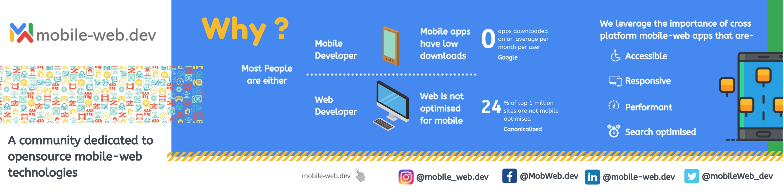
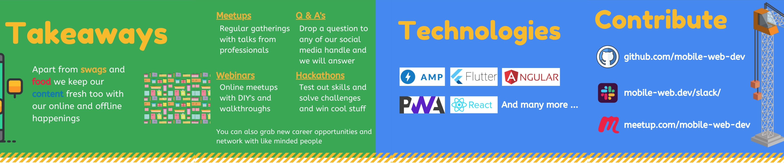

# Mobile-web.dev

    

## Initiatives

[Wordpress Crash Course](https://www.youtube.com/playlist?list=PL6IEQd6VwYfh4X_QWdmpd6xMRH9jnILyT)

[Web Hosting and Cloud Crash Course](https://www.youtube.com/playlist?list=PL6IEQd6VwYfiel0OdURL3vdq8hDA1oocC)

## Contribution Guidelines

     

- Please read our [Code of Conduct](https://github.com/mobile-web-dev/mobile-web.dev/blob/master/CONTRIBUTING.md) and [Gitflow](https://github.com/mobile-web-dev/mobile-web.dev/blob/master/CONTRIBUTING.md) for contributing towards the project.
- Write clear meaningful git commit messages (Do read [this](http://chris.beams.io/posts/git-commit/)).
- Make sure your PR's description contains GitHub's special keyword references that automatically close the related issue when the PR is merged. (Check [this](https://github.com/blog/1506-closing-issues-via-pull-requests) for more info)
- When you make very very minor changes to a PR of yours (like for example fixing a text in button, minor changes requested by reviewers) make sure you squash your commits afterwards so that you don't have an absurd number of commits for a very small fix. (Learn how to squash at [here](https://davidwalsh.name/squash-commits-git))
- When you're submitting a PR for a UI-related issue, it would be really awesome if you add a screenshot of your change or a link to a deployment where it can be tested out along with your PR. It makes it very easy for the reviewers and you'll also get reviews quicker.
- Always create PR to `develop` branch.

## The Team

  

| Name                                  | GitHub Usernames |
| ---------------------------------------------------- | -------------------------- |
| Aman Sharma | [@amanintech](https://github.com/amanintech)  |
| Siddhant Kumar | [@siddhantdante](https://github.com/siddhantdante)|
| Monika Rajput  | [@monika0123](https://github.com/monika0123)|
| Shalini Bose | [@shalinibose](https://github.com/shalinibose)|
| Anjali Sharma | [@AnjaliSharma1234](https://github.com/AnjaliSharma1234)|
| Harsh Akshit | [@harshakshit](https://github.com/harshakshit)|

## Contact us

[Youtube](https://www.youtube.com/channel/UCSQKDMqwOp43dEqDt2hBOIQ/featured) [Instagram](https://www.instagram.com/mobile_web.dev/) [Twitter](https://twitter.com/mobile_web_hq) [Linkedin](https://www.linkedin.com/company/mobile-web-dev/) [Facebook](https://www.facebook.com/MobWeb.dev/)

